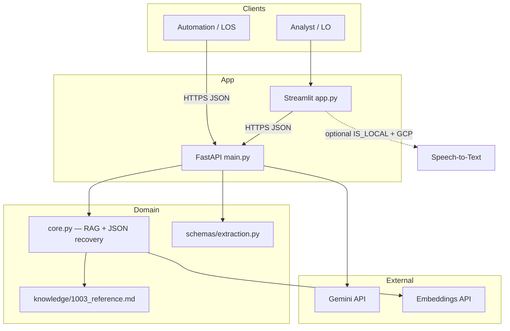
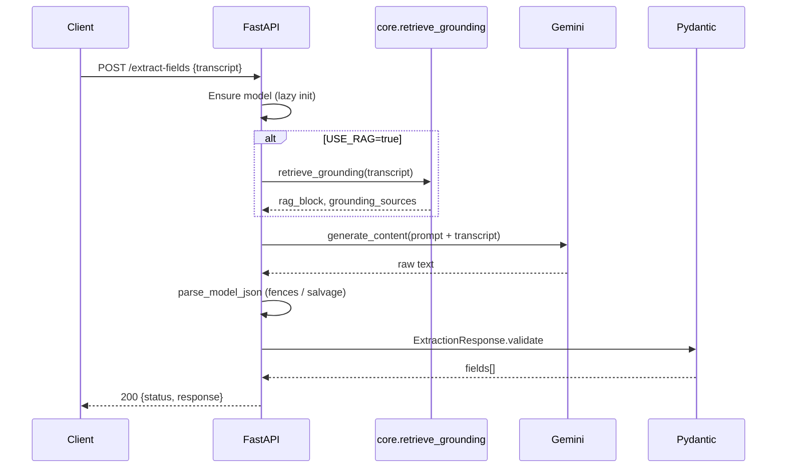
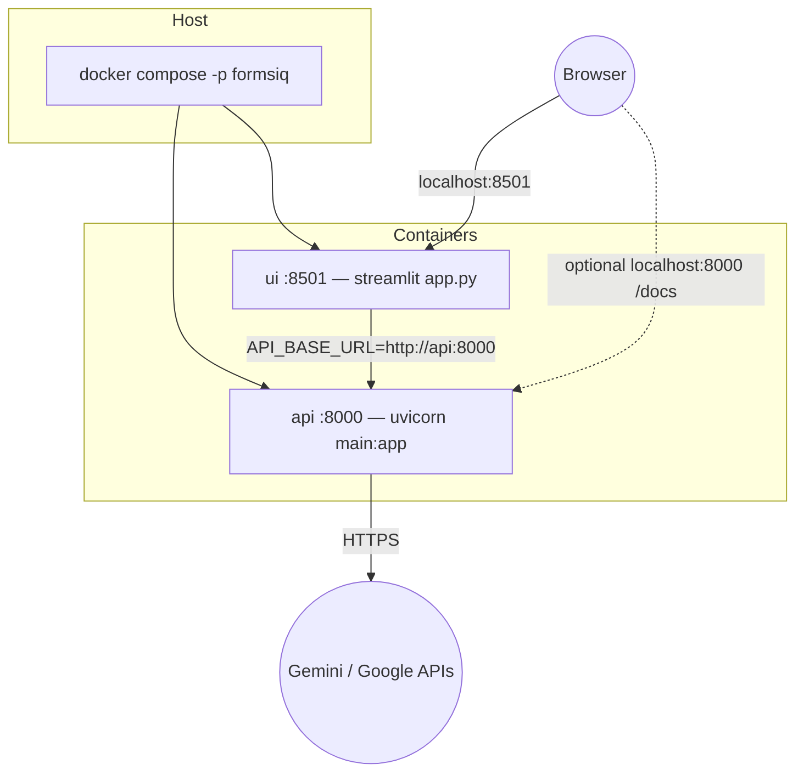

# FormsiQ

[](LICENSE)
[](https://www.python.org/downloads/)
[](https://github.com/Vedv7/formsiq-1003-extractor/actions/workflows/ci.yml)

**Production-oriented reference implementation** for turning **mortgage call transcripts** (and optional **PDF text** or **local audio**) into **structured 1003 / URLA-style loan fields** as **schema-validated JSON** with **per-field confidence scores**, suitable for human review and downstream LOS or CRM integration.

**Stack:** Streamlit (UI) · FastAPI (API) · Google Gemini (inference) · optional **RAG grounding** (internal 1003 reference) · Pydantic (validation) · Docker Compose · optional Google Speech-to-Text (local).

> **Short GitHub description (copy for “About”):**  
> *Gemini-powered 1003 URLA field extraction from transcripts and documents — FastAPI + Streamlit, schema-validated JSON, optional RAG, Docker-ready.*

---

## Table of contents

1. [Executive summary](#executive-summary)  
2. [System architecture](#system-architecture)  
3. [Request workflow](#request-workflow)  
4. [Deployment](#deployment)  
5. [API reference](#api-reference)  
6. [Configuration](#configuration)  
7. [Security & operations](#security--operations)  
8. [Quality & evaluation](#quality--evaluation)  
9. [Repository layout](#repository-layout)  
10. [Local development](#local-development)  
11. [Roadmap](#roadmap)  
12. [License](#license)  

---

## Executive summary

Mortgage intake teams routinely transcribe or read borrower conversations and manually key data into loan origination systems. FormsiQ **automates structured extraction** from natural-language transcripts by combining **LLM inference** with **strict response validation**, **robust JSON recovery** when the model wraps output in markdown, and **optional retrieval grounding** from an internal URLA-oriented knowledge base to improve field semantics.

| Design goal | How it is addressed |
|-------------|---------------------|
| Reliability | Pydantic schemas, JSON salvage pipeline, HTTP 422 on invalid payloads |
| Operability | `/health` (liveness), `/ready` (Gemini selectable), Docker Compose, CI |
| Extensibility | Pluggable `API_BASE_URL`, optional RAG via `USE_RAG`, eval harness |
| Auditability | `grounding_sources` in API responses when RAG is used |

---

## System architecture

Actors, app layers, and external services in one view:



| Layer | Responsibility |
|-------|----------------|
| **Clients** | Humans or systems consuming UI or REST. |
| **App** | Streamlit for operator UX; FastAPI for `/extract-fields`, `/health`, `/ready`. |
| **Domain** | Retrieval over `knowledge/`, JSON salvage, Pydantic validation. |
| **External** | Gemini generation; embeddings for RAG when configured. |

---

## Request workflow

`POST /extract-fields` — synchronous path through the stack:



---

## Deployment

Docker Compose runs **API** and **UI** on the host; the UI container calls the API by service name. The `ui` service waits until `api` passes **`GET /health`** so the browser does not hit a cold API during bring-up.



| Service | Host port | Purpose |
|---------|-----------|---------|
| `api` | 8000 | REST API, OpenAPI `/docs` |
| `ui` | 8501 | Streamlit operator UI |

---

## API reference

| Method | Path | Purpose |
|--------|------|---------|
| `GET` | `/health` | Liveness; JSON includes `gemini_api_key_set` (boolean). |
| `GET` | `/ready` | Readiness: API key present and Gemini model list succeeds (calls Google). |
| `POST` | `/extract-fields` | Body: `{"transcript": "..."}`. Query: `use_rag` (default `true`). |

**Example request**

```json
{
  "transcript": "Hi, my name is John Doe. I make $120,000 annually and I am applying for a home purchase loan."
}
```

**Example response (truncated)**

```json
{
  "status": "success",
  "response": {
    "fields": [
      {
        "field_name": "Borrower Name",
        "field_value": "John Doe",
        "confidence_score": 0.96
      }
    ],
    "grounding_sources": ["1003 URLA — Borrower identity"]
  }
}
```

`confidence_score` is **model-reported** (prompted) and **bounded** by Pydantic to \[0, 1\]. `grounding_sources` lists titles of internal chunks used when RAG retrieval runs; it may be empty if RAG is disabled or retrieval yields none.

---

## Configuration

| Variable | Scope | Description |
|----------|--------|-------------|
| `GEMINI_API_KEY` | API (required for extraction) | Google AI Studio / Gemini API key. |
| `USE_RAG` | API | `true` / `false` — enable retrieval grounding (default `true`). |
| `API_BASE_URL` | Streamlit | Base URL for `POST /extract-fields` (Compose sets `http://api:8000`). |
| `IS_LOCAL` | Streamlit | When `true`, enables optional Google Speech audio upload path + local GCP creds. |

Copy `.env.example` to `.env` for local and Docker Compose interpolation. **Never commit real `.env` files.**

---

## Security & operations

- **Secrets:** Store `GEMINI_API_KEY` in environment or a secret manager; rotate if ever leaked. The repository intentionally **does not** track `.env`.
- **Data handling:** This reference app does **not** implement a database; transcripts are processed in memory for the request. For production, add explicit **data retention**, **encryption in transit** (TLS termination), and **access control** in front of the API.
- **Speech / PDF:** Optional paths increase surface area — restrict `IS_LOCAL` and GCP credentials to trusted environments only.
- **Health monitoring:** Use `/health` for orchestrator liveness; use `/ready` only if you accept an outbound call to Google on each check (model init is cached in-process after first success).

---

## Quality & evaluation

- **CI:** GitHub Actions workflow (`.github/workflows/ci.yml`) runs `compileall` and `tests/test_core.py` without network or API keys.
- **Field-level eval:** Add labeled fixtures under `eval/fixtures/` and run:

```bash
export API_BASE_URL=http://127.0.0.1:8000   # Linux / macOS
# set API_BASE_URL=http://127.0.0.1:8000     # Windows CMD
python eval/run_eval.py
```

Reported **Overall** percentage is **exact match** on normalized `(field_name, value)` pairs against your gold file — use it for defensible accuracy claims after you define a sufficiently large and representative fixture set.

---

## Repository layout

```text
.
├── app.py                      # Streamlit UI
├── main.py                     # FastAPI application (lazy Gemini init)
├── core.py                     # JSON recovery + RAG retrieval
├── knowledge/
│   └── 1003_reference.md       # Internal grounding corpus (chunked)
├── schemas/
│   └── extraction.py         # Pydantic models
├── eval/
│   ├── run_eval.py
│   └── fixtures/*.json
├── scripts/
│   ├── up.ps1
│   └── up.sh
├── tests/
│   └── test_core.py
├── .github/workflows/ci.yml
├── Dockerfile
├── docker-compose.yml
├── Makefile
├── LICENSE
├── requirements.txt
└── README.md
```

---

## Local development

**Clone**

```bash
git clone https://github.com/Vedv7/formsiq-1003-extractor.git
cd formsiq-1003-extractor
python -m venv .venv
.venv\Scripts\activate          # Windows
# source .venv/bin/activate     # Linux / macOS
pip install -r requirements.txt
```

**Run API + UI (two terminals)**

```bash
cp .env.example .env   # then set GEMINI_API_KEY
uvicorn main:app --reload --host 127.0.0.1 --port 8000
```

```bash
export API_BASE_URL=http://127.0.0.1:8000
streamlit run app.py
```

**Docker (recommended parity with production-like deploy)**

```bash
docker compose -p formsiq up --build
```

Helpers: `.\scripts\up.ps1`, `./scripts/up.sh`, or `make up`.

---

## Roadmap

| Priority | Item |
|----------|------|
| P1 | Hardened authn/z on API (API keys or OAuth2 proxy) |
| P1 | Structured logging + request IDs |
| P2 | Broader managed deployment for speech-to-text |
| P2 | OCR / image pipeline for scanned documents |
| P3 | Multi-language transcripts |
| P3 | LOS-specific export adapters |

---

## License

This project is licensed under the **MIT License** — see [LICENSE](LICENSE).

---

## Author

**Veda Swaroop**  
AI / ML Engineer · Agentic systems · Mortgage automation
